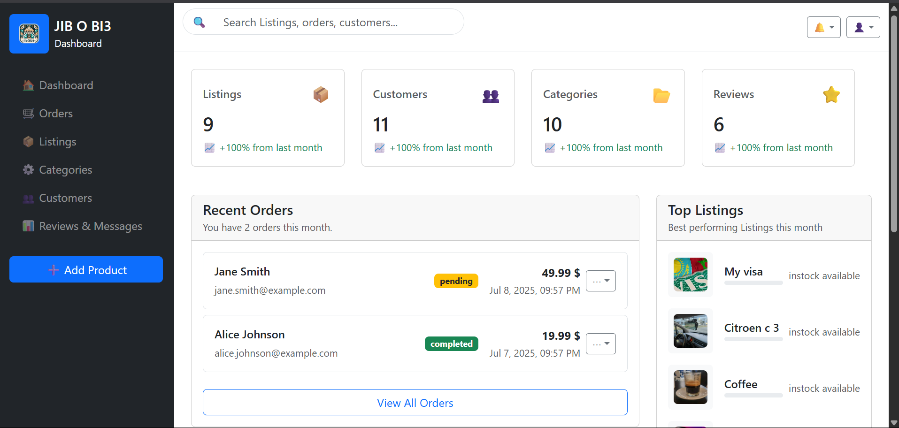

# 🛠️ Jib o Bi3 Admin Dashboard

Welcome to the **Jib o Bi3** admin dashboard! This dashboard helps you manage listings, users, and more for your mobile app.


---

## 📸 Dashboard Screenshot



---


~~~
src/
├── api/                  # API calls (axios)
│   └── api.js
├── components/ # Reusable UI
│   ├── layout/     # Header, Sidebar, Footer
│   └── ui/         # Cards, Charts, Tables
│   │   ├── StatsCard.js
│   │   ├── DashboardChart.js
│   │   └── DataTable.js
├── pages/                # Main views
│   ├── Dashboard.js
│   ├── Users.js
│   └── Login.js
│   ├── Users.js
│   └── Settings.js
├── context/              # Auth state
│   └── AuthContext.js
├── styles/               # Global CSS
│   └── global.css
└── App.js
~~~


## 🚀 Key Pages

### 1️⃣ Dashboard Overview
- Summary cards: total users, total listings, new listings.
- Recent activity and notifications.
- Charts for trends (top categories, listing growth).

### 2️⃣ User Management
- List of registered users.
- Filters and search (by name, email, activity).
- Actions: view, edit, enable/disable, delete.

### 3️⃣ Listings Management
- All listings with filters (active, pending, sold).
- Actions: view, edit, approve/reject, delete.
- Bulk actions (e.g., approve multiple listings).

### 4️⃣ Category Management
- Manage categories and subcategories.
- Add, edit, and delete categories.

### 5️⃣ Reports and Analytics
- Key insights: most popular categories, total listings sold, traffic patterns.
- Charts and tables for data visualization.

### 6️⃣ Admin Profile / Settings
- Manage admin details.
- Change password, manage roles if needed.

---

## 🎨 UI Library

We recommend using one of the following UI libraries:

- **Material UI (MUI)** – Comprehensive, modern, and customizable.  
- **Ant Design (AntD)** – Clean, enterprise-grade dashboard UI.  
- **Chakra UI** – Lightweight and flexible with built-in dark mode support.  
- **Tailwind CSS (with Headless UI or DaisyUI)** – Utility-first, highly customizable.  
- **Shadcn/ui** – Sleek, accessible components built with Tailwind.

For **Jib o Bi3**, **Ant Design** or **MUI** are excellent choices for a polished, data-heavy dashboard.

---

## 💡 UX Best Practices

✅ **Clear Navigation** – Sidebar or top bar with intuitive icons and labels.  
✅ **Consistent Layout** – Same header/footer for all pages.  
✅ **Search and Filters** – Easy data exploration for users and listings.  
✅ **Feedback and Confirmations** – Use modals and toasts/snackbars for actions.  
✅ **Responsiveness** – Works across desktops and tablets.  
✅ **Loading States** – Spinners or skeleton loaders to indicate data loading.  
✅ **Accessibility** – Keyboard-friendly and high-contrast colors.

---

## 🔌 API Integration

Your Node.js API, already used by the mobile app, will also be used by the dashboard.

### Key Integration Steps

1️⃣ Use the same API endpoints (e.g., `/users`, `/listings`).  
2️⃣ Implement authentication (JWT tokens) in the dashboard just like the mobile app.  
3️⃣ Ensure your Node.js API **CORS** configuration allows requests from the dashboard’s domain.

Example Node.js CORS setup:
```js
const cors = require('cors');
app.use(cors({
  origin: ['https://your-dashboard-domain.com', 'http://localhost:3000'],
  credentials: true
}));
